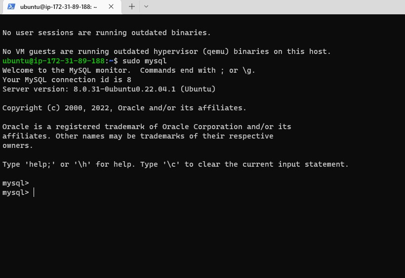
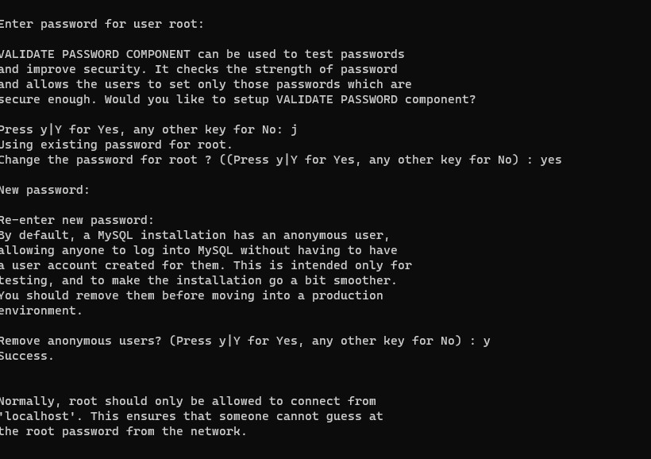
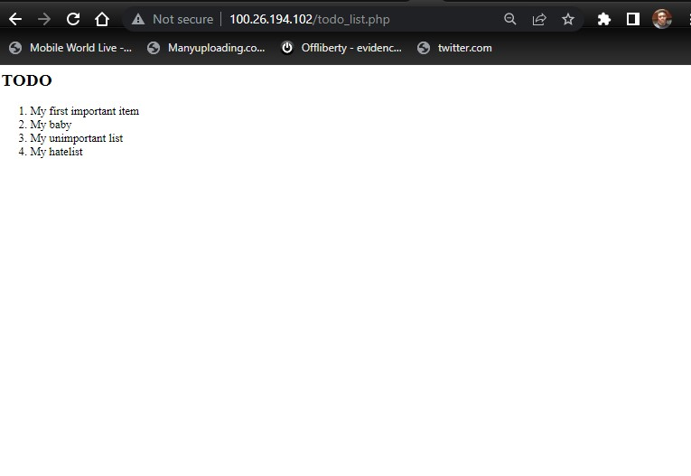

# Project2: STEP 1
### Install Nginx on your server

`sudo apt update`
`sudo apt install nginx`


### Check if the webserver is accessable from our shell
`curl http://127.0.0.1:80`


### Check if we can access the webserver from a browseR. First get your Ip address.
`curl -s http://169.254.169.254/latest/meta-data/public-ipv4`
`http://<Public-IP-Address>:80`


# Project 2: STEP 2
### Installing MySQL

`sudo apt install mysql-server`

### Log into the MySQL console as root
`sudo mysql`


### Set password for user root using mysql native password as default authentication method. Password is 'PassWord.1
`ALTER USER 'root'@'localhost' IDENTIFIED WITH mysql_native_password BY 'PassWord.1';`

### Exit MySQL
`exit`

### Run a recommended security script to remove some insecure settings and restrict access
`sudo mysql_secure_installation`

### Input the password set above. When prompted to configure the Validate passworf plugin, choose "NO". On further prompt to change root password, choosw "YES" and choose a new password. Choose "YES" on all other prompts.



### Try to log in again when you done with the above step using the command below with the "-p" flag. This will prompt for password for root user.
`sudo mysql -p`

### If the above is successful then you have successfully set that a password is required to login as a root user. Exit MySQL.
`exit`

# Project 2: STEP 3
### Installing PHP

### Install PHP to process the code and give a display to the end-user. For nginx, you need to install php-fpm. This helps the webserver process php. Also install php-mysql. This module allows php communicate with our mysql database.** 

`sudo apt install php-fpm php-mysql`

# Project 2: STEP 4
### Configure nginx to use php processor. i.e create a different virtual host for a domain you want to host

### Create your domain directory
`sudo mkdir /var/www/projectLEMP`

### Change ownership of our directory from root to the user
`sudo chown -R $USER:$USER /var/www/projectLEMP`

### Create a new configuration file in Nginx's site-available directory and add the following configuration
```
#/etc/nginx/sites-available/projectLEMP

server {
    listen 80;
    server_name projectLEMP www.projectLEMP;
    root /var/www/projectLEMP;

    index index.html index.htm index.php;

    location / {
        try_files $uri $uri/ =404;
    }

    location ~ \.php$ {
        include snippets/fastcgi-php.conf;
        fastcgi_pass unix:/var/run/php/php8.1-fpm.sock;
     }

    location ~ /\.ht {
        deny all;
    }

}
```
`vi sudo /etc/nginx/sites-available/projectLEMP`

### Activate your configuraton by linking it to the config file in nginx sites-enabled directory
`sudo ln -s /etc/nginx/sites-available/projectLEMP /etc/nginx/sites-enabled/`

### Test the configuration for syntax error
`sudo nginx -t`


### Disable the default nginx host
`sudo unlink /etc/nginx/sites-enabled/default`

### Reload nginx to apply changes
`sudo systemctl reload nginx`

### Create an index.html file in our root direction
`sudo echo 'Hello LEMP from hostname' $(curl -s http://169.254.169.254/latest/meta-data/public-hostname) 'with public IP' $(curl -s http://169.254.169.254/latest/meta-data/public-ipv4) > /var/www/projectLEMP/index.html`

### Go to our browser and open our website url
`http://<Public-IP-Address>:80`


### Access the website using the public DNS name
`http://<Public-DNS-Name>:80`


# PROJECT 2: STEP 5
### Configuring Nginx to Use PHP processor

### Test if Nginx can correctly handle .php files. Do this by creating a PHP file in your root directory. create a info.php file and insert the following:
```
<?php
phpinfo();
```
`sudo vi /var/www/projectLEMP/info.php`

### Access this page in your browser using your public DNS name or ip address/info.php
`http://server_domain_or_IP/info.php`

### Remove the file if the above command is successful to protect sensitive information.
`sudo rm /var/www/your_domain/info.php`


# Project 2: STEP 6
### Retrieving data from MySQL database.

### First log into your console
`sudo mysql -p`

### Create a new database
`CREATE DATABASE `example_database`;`

### Then create a new user and add and grant him full privileges on the database. When creating the user, define "password" as the password using mysl default authentication method.
`CREATE USER 'example_user'@'%' IDENTIFIED WITH mysql_native_password BY 'password';` 

### Give the user full privileges over the database created above
`GRANT ALL ON example_database.* TO 'example_user'@'%';`

### exit the shell
`exit`

### Test if the user has proper permissions by logging into the MySQL console with the user credentials
`mysql -u example_user -p`


### Confirm that the user has access to the dright database
`SHOW DATABASES;`


### Create a table named todo list with the following statement
`INSERT INTO example_database.todo_list (content) VALUES ("My first important item");`
```
CREATE TABLE example_database.todo_list (
mysql>     item_id INT AUTO_INCREMENT,
mysql>     content VARCHAR(255),
mysql>     PRIMARY KEY(item_id)
mysql> );
```
### Insert few rows of content into the table. Repeat the command with different values


### Confirm your table is correct
`SELECT * FROM example_database.todo_list;`


### Exit the MySQL console
`exit`

### Create a php script that will connect to MySQL and query for content
`vi /var/www/projectLEMP/todo_list.php`

```
<?php
$user = "example_user";
$password = "password";
$database = "example_database";
$table = "todo_list";

try {
  $db = new PDO("mysql:host=localhost;dbname=$database", $user, $password);
  echo "<h2>TODO</h2><ol>";
  foreach($db->query("SELECT content FROM $table") as $row) {
    echo "<li>" . $row['content'] . "</li>";
  }
  echo "</ol>";
} catch (PDOException $e) {
    print "Error!: " . $e->getMessage() . "<br/>";
    die();
}
```

### Access the page in your web browser
`http://<Public_domain_or_IP>/todo_list.php`




